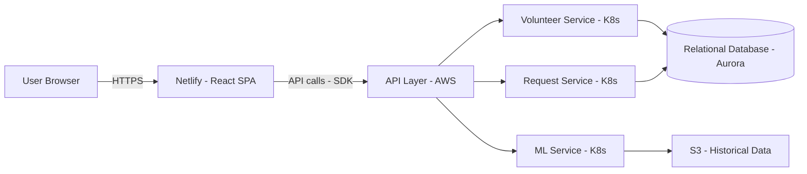

# Saayam Test Application – Architecture & Operational Flow

**Version:** 1.0  
**Owners:** Engineer A (UI Lead), Engineer B (AWS/Backend Lead)  
**Last Updated:** 2025-08-26

---

## 1. Overview
The Saayam Test Application is a **React single-page application (SPA)** hosted on **Netlify**. It communicates with backend services running on **AWS** (via an API layer). This doc focuses on **UI flows** (Engineer A) and includes a high-level diagram for context.

---

## 2. High-Level Architecture (context)
> The UI portion is: **Browser → Netlify (React SPA) → API Layer**.

---

## 3. UI Component Flows (Engineer A)

The UI is a React SPA with the following main flows:

### Landing Page (Home)
- Components: Hero banner, carousel, mission statement, call-to-action buttons.
- No authentication required.

### About Us
- Static information page describing mission, values, and team.

### Volunteer Services
- Lists available support categories: Food, Housing, Clothing, Education, Healthcare, etc.
- Links to “Become a Volunteer” registration form (requires login).

### Login / Sign Up
- Auth handled via API calls to backend.
- Post-login redirects to Volunteer Dashboard or Beneficiary Dashboard depending on role.

### Volunteer Dashboard
- Shows My Requests table with filters and search.
- Requests displayed with ID, Type, Subject, Status, Category, Priority, and Calamity.
- Options to update status or close requests (calls backend APIs).

### Create Help Request (Beneficiary flow)
- Form to submit new help requests.
- Sends data via API to Request Service.

### Notifications
- Shows updates on request progress and volunteer assignments.

### Donate
- External or integrated payment gateway.
- Links to backend for transaction logging.
